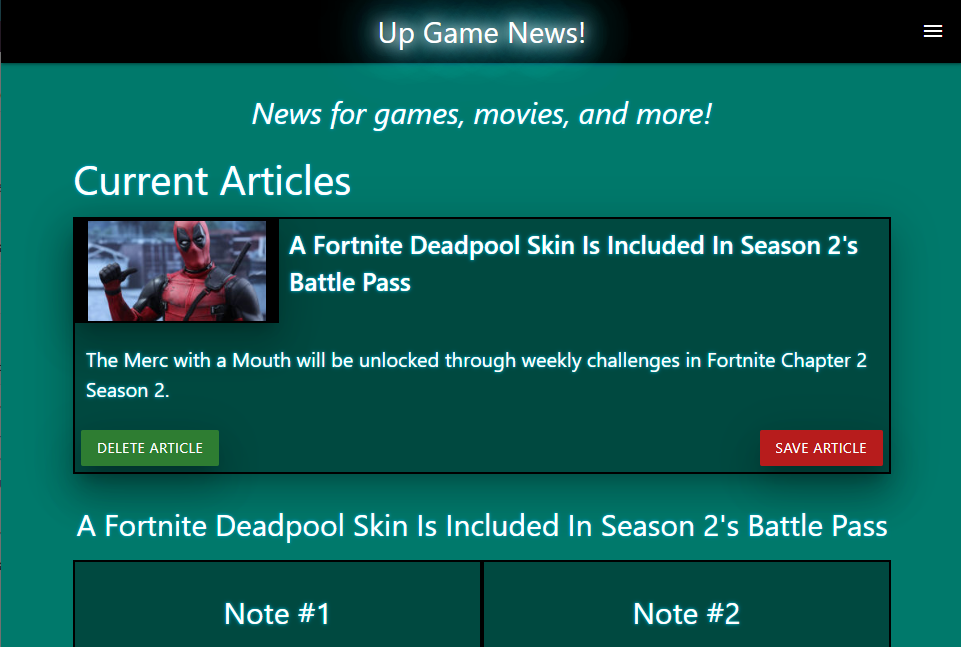
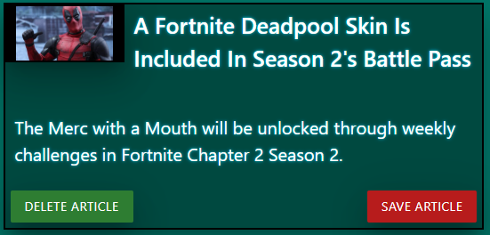
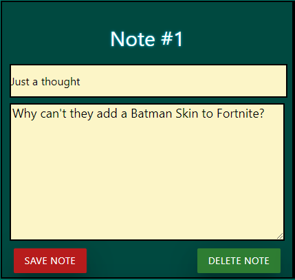
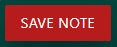
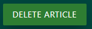
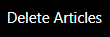
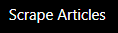
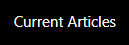
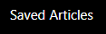

# UpGameNews

Get freshly scraped GameSpot news for games, movies, and more!

## Site Features
- - -

Every time you go to the landing page you will view all the recent news from GameSpot.

* Click an article's title or summary to leave a note for other users to read.

* Write a title for a note and a message in the area's provided. Then click the &nbsp;&nbsp;  &nbsp;&nbsp; button.

* You can update note's the same way!

* If you don't like a note, click the &nbsp;&nbsp;  &nbsp;&nbsp; button.

- - -

* Save an article if you would like to read it later by clicking the &nbsp;&nbsp;  &nbsp;&nbsp; button.

* You can delete an article that you are done reading or not interested in by clicking the &nbsp;&nbsp;  &nbsp;&nbsp; button.

- - -

If you would would like to delete all the article's that are not saved click the &nbsp;&nbsp;  &nbsp;&nbsp; link in the navigation menu.

You can scrape for new articles at anytime making the newest articles go to the top of the screen. Click the &nbsp;&nbsp;  &nbsp;&nbsp; link in the navigation menu to do this.

Click the &nbsp;&nbsp;  &nbsp;&nbsp; link in the navigation menu to to display all the current article's if you don't won't to look for any new article's.

All saved acticles can be accessed via the  &nbsp;&nbsp; link in the navigation menu.